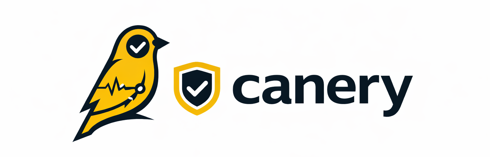
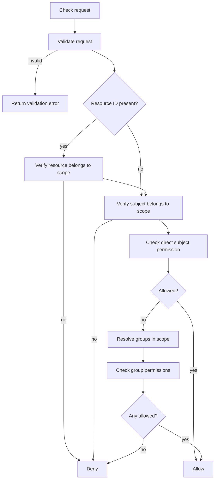
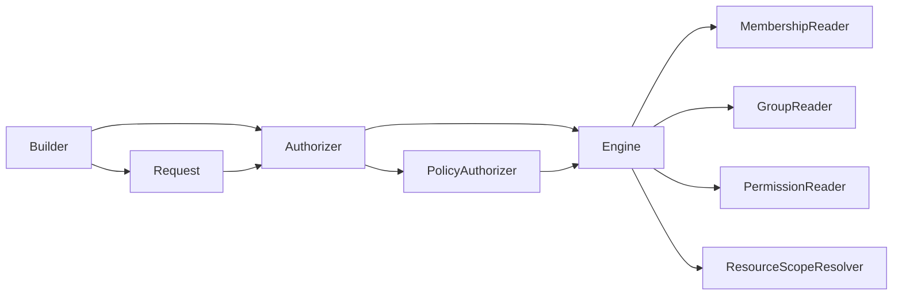

<p align="center">
  
</p>

[](https://github.com/rluders/canery/actions/workflows/ci.yml)

[](https://pkg.go.dev/github.com/rluders/canery)
[](https://goreportcard.com/report/github.com/rluders/canery)
[](https://github.com/rluders/canery/releases)
[](https://codecov.io/gh/rluders/canery)
[](LICENSE)


## 🧠 What is canery?

`canery` is a **minimal, generic authorization engine** built around a simple and explicit model:

* **subject**
* **action**
* **resource**
* **scope**

It focuses purely on **authorization evaluation**, not storage or product semantics.

> It answers: *“Can X do Y on Z within W?”*

## ⚡ Why use it?

Most authorization solutions are either:

* too **opinionated** (roles, orgs, workspaces baked in)
* too **heavy** (full IAM platforms)

`canery` stays in the middle:

* ✅ explicit and predictable request model
* ✅ no framework or product lock-in
* ✅ pluggable data sources
* ✅ small, composable core
* ✅ easy to test

## 🚫 What it does NOT do

* ❌ does not store permissions
* ❌ does not define roles or org models
* ❌ does not include a database layer
* ❌ does not enforce product semantics

You bring those via adapters.

## 🚀 Quick Example

```go
ok, err := authorizer.Check(ctx, canery.Request{
  Subject:  canery.Actor("user", userID),
  Action:   canery.Action("delete"),
  Resource: canery.Resource("document", documentID),
  Scope:    canery.Scope("project", projectID),
})
```

## 🔍 Decision Details

```go
decision, err := authorizer.CheckDecision(ctx, canery.Request{
  Subject:  canery.Actor("user", userID),
  Action:   canery.Action("delete"),
  Resource: canery.Resource("document", documentID),
  Scope:    canery.Scope("project", projectID),
})

if decision.Allowed {
  fmt.Println(decision.Source) // "direct" or "group"
} else {
  fmt.Println(decision.Source) // "none"
  fmt.Println(decision.Reason) // e.g. "no matching permission"
}
```

## 🧱 Fluent API

```go
ok, err := authorizer.
  For(canery.Actor("user", userID)).
  Can(canery.Action("delete")).
  Target(canery.Resource("document", documentID)).
  In(canery.Scope("project", projectID)).
  Check(ctx)
```

## 🔁 Multiple Actions

```go
result, err := authorizer.
  For(canery.Actor("user", userID)).
  CanMany(
    canery.Action("view"),
    canery.Action("update"),
    canery.Action("delete"),
  ).
  Target(canery.Resource("document", documentID)).
  In(canery.Scope("project", projectID)).
  Check(ctx)

canUpdate, _ := result.Allowed(canery.Action("update"))
```

## 📦 Batch Checks

```go
decisions, err := engine.BatchCheck(ctx, []canery.Request{
  {
    Subject:  canery.Actor("user", userID),
    Action:   canery.Action("view"),
    Resource: canery.Resource("document", documentID),
    Scope:    canery.Scope("project", projectID),
  },
  {
    Subject:  canery.Actor("user", userID),
    Action:   canery.Action("delete"),
    Resource: canery.Resource("document", documentID),
    Scope:    canery.Scope("project", projectID),
  },
})
```

## 🧪 Debugging (Trace)

```go
decision, trace, err := authorizer.CheckTrace(ctx, canery.Request{
  Subject:  canery.Actor("user", userID),
  Action:   canery.Action("delete"),
  Resource: canery.Resource("document", documentID),
  Scope:    canery.Scope("project", projectID),
})

for _, step := range trace.Steps {
  fmt.Println(step.Name, step.Result)
}

_ = decision
```

## ⚙️ Default Evaluation Strategy

The default `Engine` uses a **membership-first evaluation flow**:



This is just the default engine — other evaluation strategies can be implemented.

## 🧩 Architecture



## 🔌 Extensibility

All data access is delegated to interfaces:

* `MembershipReader`
* `GroupReader`
* `PermissionReader`
* `ResourceScopeResolver`

This keeps the core:

* stateless
* storage-agnostic
* easy to test

## 🧠 Policies (Optional)

```go
authorizer := canery.NewPolicyAuthorizer(
  baseAuthorizer,
  canery.ForResourceType("document", canery.PolicyFunc(func(ctx context.Context, request canery.Request, next canery.DecisionEvaluator) (canery.Decision, error) {
    if request.Action == canery.Action("archive") {
      return canery.Decision{
        Allowed: false,
        Reason:  "policy matched",
        Source:  canery.DecisionSourceNone,
      }, nil
    }
    return next.CheckDecision(ctx, request)
  })),
)
```

Policies are:

* additive
* matcher-based
* optional

They **do not introduce framework conventions or magic**.

## 🧱 Adapter Pattern (Recommended)

Keep your application semantics outside the core:

```go
package projectauthz

import "github.com/rluders/canery"

const EditDocument = canery.Action("edit")

func User(id string) canery.Subject {
  return canery.Actor("user", id)
}

func ProjectScope(id string) canery.ScopeRef {
  return canery.Scope("project", id)
}

func Document(id string) canery.ResourceRef {
  return canery.Resource("document", id)
}
```

Usage:

```go
ok, err := authorizer.
  For(projectauthz.User(userID)).
  Can(projectauthz.EditDocument).
  Target(projectauthz.Document(documentID)).
  In(projectauthz.ProjectScope(projectID)).
  Check(ctx)
```

## 📂 Examples

* `examples/simple` → minimal core usage
* `examples/advanced` → realistic app setup (users, projects, roles, etc.)

Each example is a standalone Go module.

## ⚠️ Validation Rules

* `subject` → requires `Type` and `ID`
* `action` → must be non-empty
* `resource` → requires `Type`
* `scope` → requires `Type` and `ID`

Invalid requests return a structured `ValidationError`
(`errors.Is(err, canery.ErrInvalidRequest)` still works)

## 🎯 When to use canery

Use it when you want:

* explicit, testable authorization logic
* full control over your data model
* no framework constraints

Avoid it if you need:

* a complete IAM system
* UI, policy language, or managed service
* out-of-the-box RBAC/ABAC models

## 📄 License

MIT
