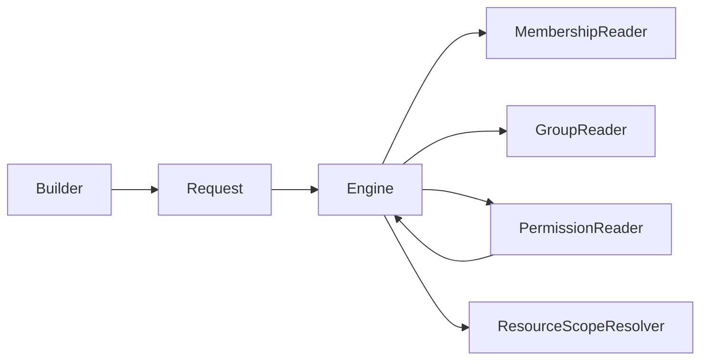
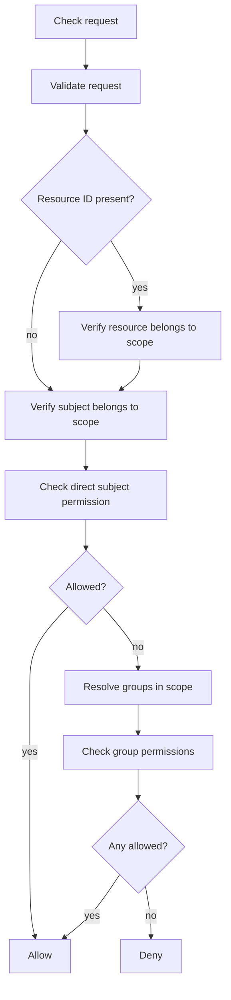

# `canery`

`canery` is a small authorization core built around checks shaped as:

- `subject`
- `action`
- `resource`
- `scope`

It stays generic on purpose:
- it is not a full IAM system
- it does not store permissions by itself
- it does not define product semantics such as workspace, organization, or task

Authorization data comes from pluggable readers and resolvers. Product
semantics belong in thin adapter packages outside the core package.

`Engine` is the default shipped evaluator. It applies one membership-scoped
pipeline over the generic request model, but it is not the only authorization
strategy the package is meant to support over time.

## Design Goals

- Keep the low-level request model explicit
- Provide a fluent builder for readability
- Delegate storage and lookup to pluggable interfaces
- Avoid hardcoding product semantics into the core engine

## Quick Start

Direct request API:

```go
ok, err := authorizer.Check(ctx, canery.Request{
  Subject:  canery.ActorRef{Type: "user", ID: userID},
  Action:   canery.Action("delete"),
  Resource: canery.ResourceRef{Type: "document", ID: documentID},
  Scope:    canery.ScopeRef{Type: "project", ID: projectID},
})
```

Preferred naming notes:
- `ActorRef` is a readability alias for `Subject`
- `Actor(...)` is the preferred generic helper; `User(...)` is only a convenience helper
- `ResourceRef` and `ScopeRef` remain the explicit request types
- `Target(...)` and `In(...)` are readability wrappers around `On(...)` and `Within(...)`

If you want the explicit decision object instead of only the boolean outcome:

```go
decision, err := authorizer.CheckDecision(ctx, canery.Request{
  Subject:  canery.Actor("user", userID),
  Action:   canery.Action("delete"),
  Resource: canery.Resource("document", documentID),
  Scope:    canery.Scope("project", projectID),
})
```

`Decision` can carry a small generic explanation of the outcome:

```go
decision, err := authorizer.CheckDecision(ctx, canery.Request{
  Subject:  canery.Actor("user", userID),
  Action:   canery.Action("delete"),
  Resource: canery.Resource("document", documentID),
  Scope:    canery.Scope("project", projectID),
})

if decision.Allowed {
  fmt.Println(decision.Source) // "direct" or "group"
} else {
  fmt.Println(decision.Source) // "none"
  fmt.Println(decision.Reason) // generic explanation, such as "no matching permission"
}
```

If you need lightweight debugging context, `CheckTrace` also returns the
high-level evaluation path without logging anything automatically:

```go
decision, trace, err := authorizer.CheckTrace(ctx, canery.Request{
  Subject:  canery.Actor("user", userID),
  Action:   canery.Action("delete"),
  Resource: canery.Resource("document", documentID),
  Scope:    canery.Scope("project", projectID),
})

for _, step := range trace.Steps {
  fmt.Println(step.Name, step.Result)
}

_ = decision
```

The same low-level request can also use thin helper constructors:

```go
ok, err := authorizer.Check(ctx, canery.Request{
  Subject:  canery.Actor("user", userID),
  Action:   canery.Action("delete"),
  Resource: canery.Resource("document", documentID),
  Scope:    canery.Scope("project", projectID),
})
```

Fluent builder API:

```go
ok, err := authorizer.
  For(canery.ActorRef{Type: "user", ID: userID}).
  Can(canery.Action("delete")).
  Target(canery.ResourceRef{Type: "document", ID: documentID}).
  In(canery.ScopeRef{Type: "project", ID: projectID}).
  Check(ctx)
```

Builder calls can also use the same helper constructors:

```go
ok, err := authorizer.
  For(canery.Actor("user", userID)).
  Can(canery.Action("delete")).
  Target(canery.Resource("document", documentID)).
  In(canery.Scope("project", projectID)).
  Check(ctx)
```

For the same subject/resource/scope, you can also evaluate multiple actions at
once:

```go
result, err := authorizer.
  For(canery.Actor("user", userID)).
  CanMany(canery.Action("view"), canery.Action("update"), canery.Action("delete")).
  Target(canery.Resource("document", documentID)).
  In(canery.Scope("project", projectID)).
  Check(ctx)

canUpdate, _ := result.Allowed(canery.Action("update"))
```

For repeated low-level checks, the engine also exposes a batch API:

```go
decisions, err := engine.BatchCheck(ctx, []canery.Request{
  {
    Subject:  canery.Actor("user", userID),
    Action:   canery.Action("view"),
    Resource: canery.Resource("document", documentID),
    Scope:    canery.Scope("project", projectID),
  },
  {
    Subject:  canery.Actor("user", userID),
    Action:   canery.Action("delete"),
    Resource: canery.Resource("document", documentID),
    Scope:    canery.Scope("project", projectID),
  },
})
```

If you want to group rules around a resource type or another higher-level
concept, you can wrap the base authorizer with optional policies:

```go
authorizer := canery.NewPolicyAuthorizer(
  baseAuthorizer,
  canery.ForResourceType("document", canery.PolicyFunc(func(ctx context.Context, request canery.Request, next canery.DecisionEvaluator) (canery.Decision, error) {
    if request.Action == canery.Action("archive") {
      return canery.Decision{
        Allowed: false,
        Reason:  "policy matched",
        Source:  canery.DecisionSourceNone,
      }, nil
    }
    return next.CheckDecision(ctx, request)
  })),
)
```

Other generic match helpers are also available when policy organization wants
to follow a resource, scope, or action-oriented shape:

```go
authorizer := canery.NewPolicyAuthorizer(
  baseAuthorizer,
  canery.ForScopeType("project", projectPolicy),
  canery.ForActionOnResourceType(canery.Action("archive"), "document", archivePolicy),
)
```

These helpers stay additive and matcher-based. They are meant to improve policy
organization, not to introduce framework conventions or policy auto-discovery.

`ResourceRef.ID` may be empty for create-style checks where the resource does
not exist yet.

Validation stays strict for required fields:
- `subject` requires both `Type` and `ID`
- `action` requires a non-empty value
- `resource` requires `Type`
- `scope` requires both `Type` and `ID`

When validation fails, the engine returns a structured `ValidationError` that
still satisfies `errors.Is(err, canery.ErrInvalidRequest)`.

## Architecture



## Evaluation Flow



This is the default `Engine` flow, not a statement that every future
`canery.Authorizer` must evaluate requests in exactly this order.

## Reader And Resolver Contracts

- `MembershipReader`
  Confirms whether the subject belongs to the requested scope.
- `GroupReader`
  Resolves the groups the subject belongs to within that scope.
- `PermissionReader`
  Resolves allow decisions for direct subjects and groups.
- `ResourceScopeResolver`
  Confirms that a concrete resource belongs to the requested scope.

The engine does not store permissions internally and does not talk directly to a
database or service. Those concerns belong to the reader and resolver
implementations.

## Generic Core vs App Adapters

Keep `canery` generic and move application ergonomics into a separate adapter
package owned by the application using it.

The adapter layer should stay thin. It mostly gives names to app concepts while
still building plain `canery` requests underneath:

```go
package projectauthz

import "github.com/rluders/canery"

const EditDocument = canery.Action("edit")

func User(id string) canery.Subject {
  return canery.Actor("user", id)
}

func ProjectScope(id string) canery.ScopeRef {
  return canery.Scope("project", id)
}

func Document(id string) canery.ResourceRef {
  return canery.Resource("document", id)
}
```

That keeps the core reusable while still making call sites pleasant:

```go
ok, err := authorizer.
  For(projectauthz.User(userID)).
  Can(projectauthz.EditDocument).
  Target(projectauthz.Document(documentID)).
  In(projectauthz.ProjectScope(projectID)).
  Check(ctx)
```

Non-user subjects, alternate storage backends, and evaluators that are not
membership-first are all valid uses of the core package. Those variations
should be expressed through adapters and alternate evaluators, not by pushing
application semantics into `canery`.

## License

MIT
